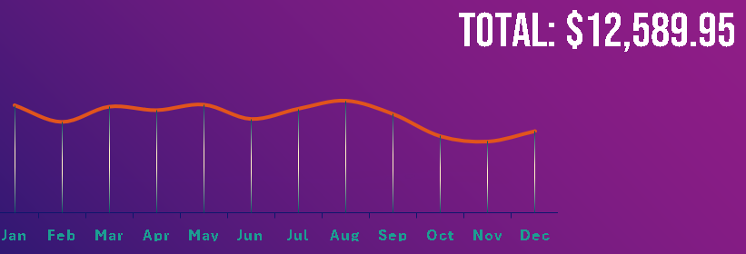
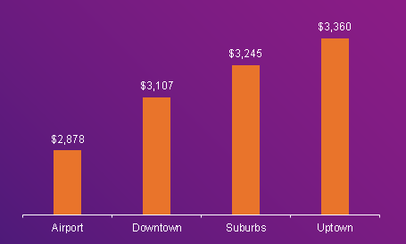
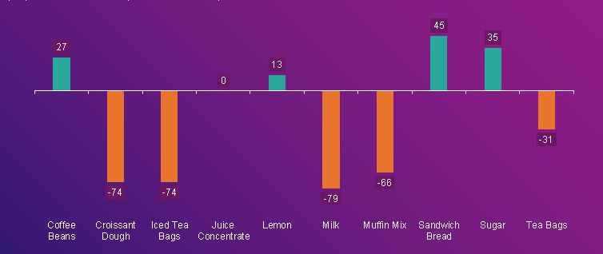
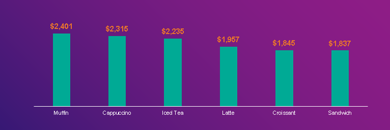

## Café Harmony Business Performance Analysis with Excel

  

---

## Business Overview
**Café Harmony** is a fast-growing café chain offering a curated selection of specialty beverages, snacks, and light meals designed to bring people together. In just over one year, the business has expanded across multiple city locations, successfully adapting each outlet to the preferences and purchasing patterns of its local community.

As the company scales to meet increasing customer demand, Café Harmony has adopted a data-driven approach to decision-making. By analyzing sales performance, inventory levels, customer behavior, and employee productivity across locations, the business is able to optimize operations, improve customer experience, and identify opportunities for sustainable growth.

Built on a foundation of innovation, consistency, and community engagement, Café Harmony leverages data not only to serve great products, but to create meaningful, repeatable value - one cup at a time.

---

## Business Problem 
The company lacks a consolidated, data-driven view of performance across products, customers, inventory, locations, and employees, limiting its ability to scale efficiently and consistently.

**Key Business Questions**

**1. Product & Menu Performance**

- Which food and beverage items drive the highest revenue and margin by location?

- How should product mix and pricing be optimized?

**2. Customer Segmentation & Value**

- Who are the highest-value customer segments by demographics?

- How can offerings be tailored to increase loyalty and average spend?

**3. Inventory & Supply Efficiency** 

- Where do stock-outs, overstock, and waste occur?

- How can inventory levels be aligned with demand patterns?

**4. Location & Workforce Performance**

- Which locations and employees outperform or underperform expectations?

- What interventions are needed to ensure consistent service quality?

---

## Project Objectives
This project applies data-driven analysis to evaluate sales performance, inventory efficiency, customer behavior, and staff productivity across locations. 

The goal is to:
- Identify operational gaps
- Optimize decision-making
- Support sustainable growth through actionable insights
- Build a flexible, filterable dashboard for stakeholders

  

---

## Data Dictionary

**1. Sales Data:** Contains information on sales transactions across different locations, including items sold, prices, quantities, and sales dates.

**2. Customer Data:** Customer details such as age, gender, location, and preferred drink items.

**3. Employee Data:** Information about employees (e.g., name, role, salary, location).

**4. Stock Data:** Inventory of raw materials and supplies needed to prepare the café's menu items.

**5. Feedback Data:** Customer satisfaction ratings and comments after each purchase.

---

## Approach & Methodology
**•	Platform:** Microsoft Excel

**•	Process:**
- Data cleaning, deduplication, and transformation
- KPI aggregation using pivot tables
- Charting through bar, line, clustered column, and donut visualizations
- Slicer-enabled interactivity across key fields
- Excel formulas (like SUMIF, COUNTIF, VLOOKUP) to analyze the data.

---

## Key Insights
### Key Performance Indicators (KPI)
**Analysis & Insight:** 
**Café Harmony** serves 1,003 customers across a lean product range of 10 stock items, supported by a workforce of 1,000 employees. Total sales reached $12,585.95, with customer feedback averaging 3.0 from 1,000 ratings, indicating stable performance with opportunities to improve customer experience and efficiency.

  

  
### Sales Trend
**Analysis & Insight:**
Sales show clear seasonality, peaking in January ($1,172) and again around August (~$1,150), before declining sharply toward year-end. Performance drops significantly from September to November, reaching a low in November ($783), indicating a late-year demand slowdown and an opportunity for targeted promotions or demand-boosting initiatives during these months

  

### Sales by Gendar
**Analysis & Insight:**
Female customers account for the majority of sales at 54%, compared to 46% from male customers, indicating slightly stronger purchasing engagement among female customers and an opportunity for targeted marketing and product positioning.

  

### Sales by Location 
**Analysis & Insight:**
Uptown recorded the highest sales at $3,360, followed by the Suburbs ($3,245**) and Downtown ($3,107), while the Airport location generated the lowest sales at $2,878. This highlights stronger demand in residential and high-traffic urban areas, suggesting an opportunity to replicate Uptown’s product mix and operating model while reassessing strategy at the Airport location.

  

### Top-5 Employee by Sales 
**Analysis & Insight:**
- Megan White led sales performance at $11,095, followed by Elizabeth Johnson ($10,702), demonstrating strong effectiveness. 
- Elizabeth Johnson also held the highest sales target ($2,973), reflecting high confidence in her delivery. 
- William Taylor and William Harris recorded the lowest targets and performance, indicating potential support or capacity gaps. 
Overall, all team members exceeded targets, suggesting conservative benchmarks or stronger-than-expected execution.

  

### Stock Performance
**Analysis & Insight:** 
Inventory analysis shows that 50% of stock items are below the recommended levels, indicating a potential risk to operations. Only juice concentrate is stocked at the ideal level, while coffee beans, lemon, sandwich bread, and sugar exceed recommended quantities, suggesting overstocking. The remaining items are understocked and require urgent replenishment to prevent stock-outs and service disruption.

  

  
### Products Revenue
**Analysis & Insight:**
Sales performance is led by Muffin, Cappuccino, and Iced Tea, each exceeding $2,000 in revenue. In contrast, Latte, Croissant, and Sandwich underperformed, generating between $1,837 and $1,957, indicating opportunities for targeted promotion or pricing optimization.

  

### Customer Ratings
**Analysis & Insight:**
Out of 1,000 customer ratings, feedback is mixed. While 416 customers (42%) gave positive ratings (4–5 stars), 378 (38%) rated the product poorly (1–2 stars), and 206 (21%) gave neutral feedback. This distribution results in an average rating of 3.0, indicating moderate satisfaction with notable polarization in customer experience.

  

---

## Recommendations
### 1. Recalibrate Sales Targets & Incentives
**Why it matters:**

All sales employees significantly exceeded their targets, suggesting that the targets may be too conservative.

**Actions:** 
- Reset targets upward using recent performance baselines.
- Introduce tiered stretch incentives to sustain momentum.
- Protect morale by pairing higher targets with clearer upside rewards.

**Impact:** Higher revenue per employee without increasing headcount.

### 2. Fix Inventory  Imbalance to Reduce Revenue Leakage
**Why it matters:** 
50% of items are understocked while others are overstocked, tying up cash and risking stock-outs.

**Actions**
- Urgently restock high-risk understocked items.
- Reduce overstock on low-velocity items (e.g., Coffee Beans, Sugar).
- Implement minimum–maximum stock thresholds tied to sales velocity.

**Impact:** Improved product availability, reduced waste, and better cash flow.

### 3. Double Down on High-Performing Products
**Why it matters:** 
Muffin, Cappuccino, and Iced Tea are top revenue drivers, while others lag.

**Actions**
- Prioritize shelf space, promotions, and bundles around top sellers.
- Use underperforming products in cross-sell or discount strategies.
- Review pricing or positioning of consistently low performers.

**Impact:** Revenue growth without expanding product range.

### 4. Improve Customer Experience Consistency
**Why it matters:**
An average rating of 3.0 with polarized feedback indicates inconsistent experiences.

**Actions**
- Analyze 1–2 star feedback to identify root causes (service, quality, wait time).
- Standardize service processes across locations.
- Tie staff incentives partly to customer satisfaction scores.

**Impact:** Higher retention, stronger brand trust, and repeat purchases.

### 5. Leverage Gender Sales Insights for Targeted Marketing
**Why it matters:**
Female customers account for 54% of sales, representing a clear demand signal.

**Actions**
- Design targeted promotions, loyalty offers, or product bundles.
- Test messaging and product placement aligned to dominant segments.

**Impact:** Higher conversion and average order value.

### 6. Build a Performance-Driven Operating Model

**Why it matters:**
The dashboard shows strong execution but limited predictive control.

**Actions**
- Introduce forward-looking KPIs (sell-through rate, stock-out risk, satisfaction trend).
- Review dashboard monthly at the executive level with action ownership assigned.
- Transition from reporting to decision-driven analytics.

**Impact:** Faster decisions, scalable growth, and executive visibility.

---

## Executive Summary
The business is performing strongly, with sales consistently exceeding targets; however, growth is constrained by conservative target setting, inventory imbalances, uneven location performance, and inconsistent customer experience. 

Recalibrating sales targets and incentives, rebalancing inventory based on demand, prioritizing high-performing products and locations, and standardizing service quality will unlock higher revenue, improve margins, and reduce operational risk. 

Shifting from descriptive reporting to action-driven KPIs with clear ownership will enable scalable, data-led growth without increasing headcount.

---

## Disclaimer
This project is for portfolio and educational display only.

No content may be reused without permission.

---

## Connect With Me
- 💼 **LinkedIn:** (https://www.linkedin.com/in/david-okeleye001/)
- 📧 **Email:** okeleyedavid2021@gmail.com
- 🌐 **Portfolio:** https://bit.ly/3N5c1p7
- 🐙 **GitHub:** https://github.com/olavidz01-dev
