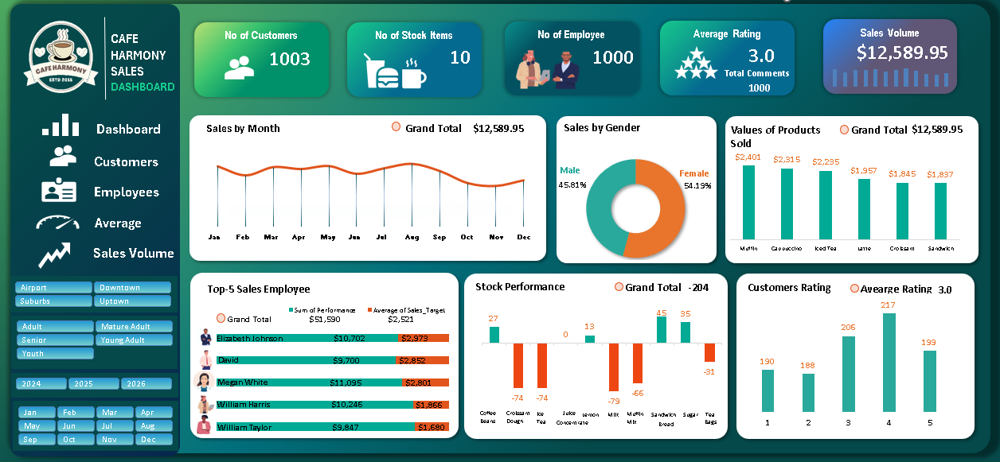
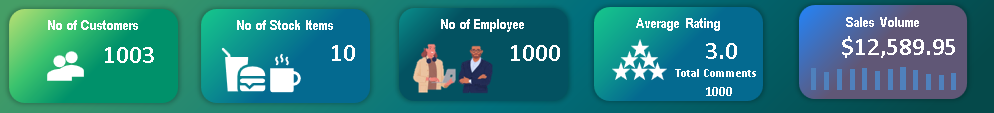

## Café Harmony Business Performance Analysis with Excel

  

---

## Business Overview
**Café Harmony** is a fast-growing café chain offering a curated selection of specialty beverages, snacks, and light meals designed to bring people together. In just over one year, the business has expanded across multiple city locations, successfully adapting each outlet to the preferences and purchasing patterns of its local community.

As the company scales to meet increasing customer demand, Café Harmony has adopted a data-driven approach to decision-making. By analyzing sales performance, inventory levels, customer behavior, and employee productivity across locations, the business is able to optimize operations, improve customer experience, and identify opportunities for sustainable growth.

Built on a foundation of innovation, consistency, and community engagement, Café Harmony leverages data not only to serve great products, but to create meaningful, repeatable value - one cup at a time.

---

## Business Problem 
The company lacks a consolidated, data-driven view of performance across products, customers, inventory, locations, and employees, limiting its ability to scale efficiently and consistently.

**Key Business Questions**

**1. Product & Menu Performance**

- Which food and beverage items drive the highest revenue and margin by location?

- How should product mix and pricing be optimized?

**2. Customer Segmentation & Value**

- Who are the highest-value customer segments by demographics?

- How can offerings be tailored to increase loyalty and average spend?

**3. Inventory & Supply Efficiency** 

- Where do stock-outs, overstock, and waste occur?

- How can inventory levels be aligned with demand patterns?

**4. Location & Workforce Performance**

- Which locations and employees outperform or underperform expectations?

- What interventions are needed to ensure consistent service quality?

---

## Project Objectives
This project applies data-driven analysis to evaluate sales performance, inventory efficiency, customer behavior, and staff productivity across locations. 

The goal is to:
- Identify operational gaps
- Optimize decision-making
- Support sustainable growth through actionable insights
- Build a flexible, filterable dashboard for stakeholders

---

## Data Dictionary

**1. Sales Data:** Contains information on sales transactions across different locations, including items sold, prices, quantities, and sales dates.

**2. Customer Data:** Customer details such as age, gender, location, and preferred drink items.

**3. Employee Data:** Information about employees (e.g., name, role, salary, location).

**4. Stock Data:** Inventory of raw materials and supplies needed to prepare the café's menu items.

**5. Feedback Data:** Customer satisfaction ratings and comments after each purchase.

---

## Approach & Methodology
**•	Platform:** Microsoft Excel

**•	Process:**
- Data cleaning, deduplication, and transformation
- KPI aggregation using pivot tables
- Charting through bar, line, clustered column, and donut visualizations
- Slicer-enabled interactivity across key fields
- Excel formulas (like SUMIF, COUNTIF, VLOOKUP) to analyze the data.

  

---

## Key Insights
### Key Performance Indicators (KPI)

  

**Analysis & Insight:** 
**Café Harmony** serves 1,003 customers across a lean product range of 10 stock items, supported by a workforce of 1,000 employees. Total sales reached $12,585.95, with customer feedback averaging 3.0 from 1,000 ratings, indicating stable performance with opportunities to improve customer experience and efficiency.

  
### Sales Trend

  

**Analysis & Insight:**
Sales show clear seasonality, peaking in January ($1,172) and again around August (~$1,150), before declining sharply toward year-end. Performance drops significantly from September to November, reaching a low in November ($783), indicating a late-year demand slowdown and an opportunity for targeted promotions or demand-boosting initiatives during these months

### 3) Top 3 employees at risk of leaving base on their performance
**Analysis & Insight:**
- **Grace Wilson** has the lowest average performance score at **3.43**, followed by **Jane Wilson (3.58)** and **Eve Davis (3.65)**, all below the team average.
- These lower scores indicate potential challenges with role fit, workload, or support, making these employees more vulnerable to disengagement and potential attrition.
- Without targeted intervention, their performance gaps could translate into increased turnover risk and lost productivity.

  

### 4) Top reasons why employees are leaving 
**Analysis & Insight:**
- The most common reason for employee departures is **personal reasons (11 exits)**, indicating a need for more flexible working arrangements and stronger employee support.
- **7** employees left for other **job opportunities**, suggesting competitive pressures related to pay, engagement, or career development.
- **Career growth limitations (5 exits)** and **retirements (5 exits)** also contribute meaningfully to turnover, highlighting gaps in progression planning and succession management.

  

### 5) Number of employees that left 
**Analysis & Insight:**
- A total of **28 employee separations** indicates a meaningful level of turnover that is likely impacting productivity, team continuity, and recruitment costs.
- When combined with department-level data, this volume of exits highlights particularly strong retention challenges within **Engineering, Marketing, and HR,** reinforcing the need for targeted engagement and retention strategies.

  

---

## Employee Performance Analysis
### 1) Number of employees with a performance score of 5.0
**Analysis & Insight:** 
- No employee achieved the maximum performance score of **5.0**, indicating that **top-tier performance is not currently being reached** across the organization.
- This suggests potential gaps in performance expectations, goal clarity, training, or employee support, which may be limiting overall productivity and engagement.

  

  
### 2) Number of employees with a performance score below 3.5
**Analysis & Insight:**
- Only **one employee** has an average performance score **below 3.5**, indicating an early performance risk.
- While limited in scale, this outlier could signal potential disengagement or skill gaps that, if left unaddressed, may impact productivity and increase the likelihood of future turnover.

  

### 3) Department with the most employees, with a performance of 5.0
**Analysis & Insight:**
- No department achieved an average performance score of **5.0**, indicating that **top-tier performance is not being reached at the team level**.
- While individual employees may perform well, the lack of consistently high departmental averages suggests potential gaps in team alignment, KPI clarity, training, or leadership effectiveness

  

### 4) Department with the most employees with a performance score below 3.5 
**Analysis & Insight:**
- No department has an average performance score below **3.5**, indicating that **performance challenges are not systemic** and are largely limited to individual employees rather than entire teams.
- This suggests that departmental leadership, training, and operational structures are generally effective and support consistent performance across the organization.

  

### 5) Average performance score by department
**Analysis & Insight:**
- Departmental performance is highly consistent, with average scores ranging from **4.00 to 4.13**, indicating stable and balanced team performance across the organization.
- **Marketing** leads slightly within this range, suggesting effective practices that could be shared across other teams, while **Sales**, at the lower end, may benefit from additional support such as clearer KPIs, updated tools, or refresher training.

  

---

## Salary Analysis
### 1) Total salary expense of NextGen Corp
**Analysis & Insight:** 
- NextGen Corp’s total salary expenditure is **$4,850,000**, representing a significant investment in its workforce and the company’s highest ongoing operational cost.
- Given the scale of this spend, even small improvements in **retention, performance, or compensation alignment** can generate substantial financial impact and improve overall return on investment in human capital.

  

  
### 2) Average salary by job title
**Analysis & Insight:**
- The **Sales Representative** role has the highest average salary at **$84,285.71**, reflecting strong revenue-driven incentives and the importance of frontline sales performance.
- **HR Specialists** follow closely at **$81,818.18**, highlighting the company’s investment in talent management and employee relations.
- Both **Engineers** and **Sales Managers** earn an average of **$80,000**, showing parity between technical expertise and sales leadership.
- **Marketing Specialists** have the lowest average at **$77,857.14**, indicating competitive but comparatively lower compensation within the organization.

  

### 3) How many employees earn above $80,000
**Analysis & Insight:**
- A total of **26 employees** earn more than **$80,000**, indicating a strong concentration of senior, specialized, and high-impact roles within NextGen Corp.
- This reflects a **competitive compensation structure** designed to attract and retain top talent in critical functions such as sales, engineering, and HR leadership.

  

### 4) How does performance correlate with salary across departments 
**Analysis & Insight:**
- **Marketing** has the highest total salary spend at **$253.9M** and also the highest average performance score **(4.13)**, indicating a strong return on compensation investment.
- **Engineering** delivers the second-highest performance **(4.10)** with a significantly lower salary cost **($192M)**, making it one of the most cost-efficient teams.
- **HR** maintains solid performance **(4.05)** with a low total salary of **$49.8M**, reflecting efficient workforce management.
- **Sales**, with a salary cost of **$24.36M** and the lowest performance score **(4.00)**, shows the greatest opportunity for performance improvement through enhanced training, incentives, or tools.

  

---

## Recommendations
### Employee Experience & Engagement
1. **Enhance Employee Support Programs**

Offer wellness initiatives, stress management resources, family-care policies, and flexible schedules to reduce personal-life attrition.

2. **Build a Positive Culture of Recognition**

Introduce employee appreciation programs, spotlight achievements, and award exceptional contributions to boost morale.

3. **Improve Internal Mobility**

Allow employees to move across teams or departments before seeking external opportunities.

4. **Create Employee Listening Channels**

Quarterly surveys, HR open-door policies, and manager check-ins to address issues early.

### Performance Management
1. **Standardize Performance Evaluation**

Implement consistent, bias-free performance criteria across all departments to ensure fair and reliable assessments.

2. **Support Low Performers Early**

Provide targeted coaching for employees with performance scores below 3.5, supported by clear improvement plans and measurable milestones.

3. **Build a High-Performance Culture**

Introduce department-level KPIs, expand coaching programs, and offer continuous upskilling to move average performance closer to top-tier benchmarks.

4. **Establish Performance-Based Rewards**

Introduce bonuses, recognition programs, and leadership opportunities to motivate high performers and reinforce strong performance trends.

### Turnover & Retention
1. **Targeted Departments Support**

Engineering, HR, and Marketing show high turnover; prioritize these departments for retention programs, workload assessments, and leadership coaching.

2. **Exit Interview Insights**

Formalize structured exit interviews to uncover root causes behind personal reasons, career growth gaps, and employees finding better jobs.

 3. **Reduce Personal-Reason Turnover**

Offer flexible work arrangements, improved leave policies, and wellness support to address personal-life–related exits.

4. **Strengthen Career Development**

Many employees left for “career growth”; create clearer promotion pathways, mentorship programs, and skill development plans.

### Salary & Compensation
1. **Conduct salary benchmarking**

Compare current salaries with industry standards to ensure competitiveness across all roles, especially marketing specialists and technical roles (engineers).

2. **Review compensation alignment**

Align salary levels with job responsibilities and performance outcomes to maintain fairness and prevent pay inequities.

3. **Strengthen incentive structures**

Maintain strong incentives for sales roles and consider performance-based bonuses for marketing, engineering, and HR to boost motivation.

4. **Build a clear salary progression framework**

Implement transparent salary ranges and growth paths so employees understand how performance and tenure lead to pay increases.

---

### Department-specific Recommendations
1. **Engineering (critical attention needed)**
- Address causes of 150% turnover: conduct workload audits, enhance leadership support, and improve team morale.
- Offer technical training and recognition programs to boost satisfaction.
2. **Marketing & HR (high turnover areas)**
- Strengthen employee support and engagement.
- Clarify role expectations, career paths, and growth opportunities.
- Reassess workload distribution and team structure.
3. **Sales (strong retention & stability)**
- Analyze and document sales’ successful retention strategies, leadership style, incentives, onboarding, and replicate what works across other departments.
4. **Company-wide**
- Ensure each department receives a tailored retention and performance plan based on turnover rate and average performance score.

---

## Executive Summary
This report analyzes employee performance, compensation, and turnover trends at NextGen Corp to identify risks and opportunities impacting workforce stability and organizational growth. The findings highlight significant retention challenges in Engineering, HR, and Marketing, contrasted with strong stability in Sales. While performance levels are generally consistent across departments, no team has yet reached top-tier performance, indicating opportunities to strengthen performance management and employee development.

Compensation analysis reveals uneven salary distribution across roles, suggesting the need for better alignment with responsibilities, performance, and market benchmarks. Based on these insights, the report recommends targeted retention initiatives, standardized performance evaluation, competitive and equitable pay structures, and stronger employee support programs.

Implementing these actions will help NextGen Corp improve retention, boost productivity, and build a more resilient, high-performing workforce.

---

## Disclaimer
This project is for portfolio and educational display only.

No content may be reused without permission.

---

## Connect With Me
- 💼 **LinkedIn:** (https://www.linkedin.com/in/david-okeleye001/)
- 📧 **Email:** okeleyedavid2021@gmail.com
- 🌐 **Portfolio:** https://bit.ly/3N5c1p7
- 🐙 **GitHub:** https://github.com/olavidz01-dev
